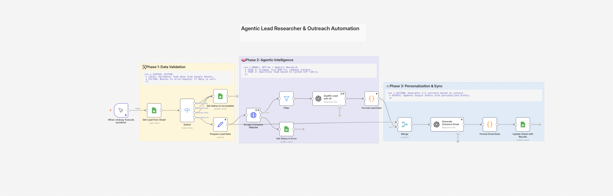

# 🤖 Agentic Lead Researcher & Outreach Automation
### *Production-Grade n8n Workflow with GPT-4o Intelligence & Custom Error Recovery*

---

## 🗺️ Workflow Architecture
This project implements a multi-stage AI Agent designed to transform raw lead data into high-conversion outreach drafts. It is built with a "Reliability-First" mindset, ensuring that network failures or malformed URLs do not interrupt the automation pipeline.



### 🛠️ The Three-Phase System
* **Phase 1: Data Validation & Sanitization**
    * Ingests leads from Google Sheets and filters for missing critical fields (e.g., Email, Company Name).
    * Routes incomplete data to a "Set status to incomplete" branch for automated logging.
* **Phase 2: Agentic Intelligence (Research & Qualification)**
    * **Live Scraper:** Dynamically extracts DOM content from company websites to understand their value proposition.
    * **GPT-4o Reasoning:** Analyzes scraped data against a custom Ideal Customer Profile (ICP) rubric to qualify the lead.
    * **Error Resilience:** Captures scraper failures (DNS/400 errors) and logs them without stopping the execution.
* **Phase 3: Hyper-Personalization & Sync**
    * **Contextual Generation:** Creates 1:1 email drafts using specific insights gathered during Phase 2.
    * **Master Record Update:** Syncs all findings, qualification scores, and drafts back to the Google Sheet.

---

## 🔧 Advanced Error Handling
A core feature of this repository is the ability to handle **Axios/HTTP 400 errors** gracefully. Standard n8n nodes often return a "triple-encoded" string when a request fails; this workflow includes custom logic to "unwrap" that string into human-readable logs.

**The Technical Solution:**
The workflow uses a custom expression to strip the `400 - ` prefix and parse the internal JSON body:

```javascript
{{ JSON.parse($json.error.message.substring($json.error.message.indexOf('{'))).readableMessage }}
